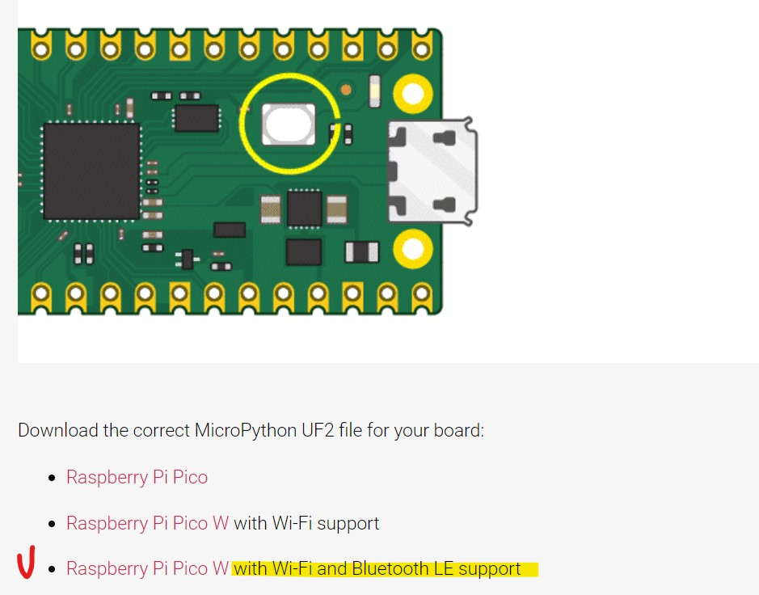
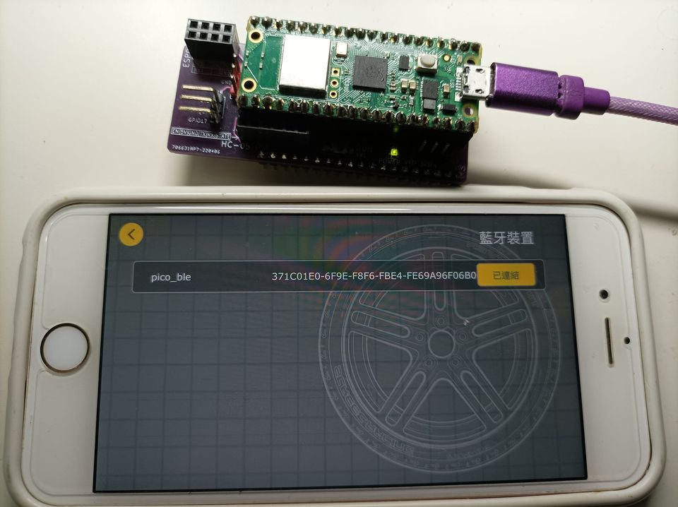
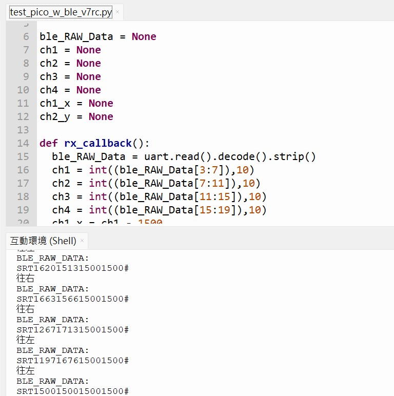

   
# Pico W 藍牙搭配手機 V7RC app
# 2023/07/27 update ios / android 皆可用了

Pico W 需先更新最新支援 BLE 功能的 micropython 韌體
官方韌體 link : 
https://www.raspberrypi.com/documentation/microcontrollers/micropython.html

兩個 library 
- ble_advertising.py 
內容為 connecting-to-the-internet-with-pico-w.pdf 書上的 section6.1 範例 

- ble_uart_v7rc.py
為網路上 google 到的內容修改為 V7RC 可用

## 主要測試的 code，搭配 V7RC 坦克模式來使用
===================================================
- test_pico_w_ble_v7rc.py

